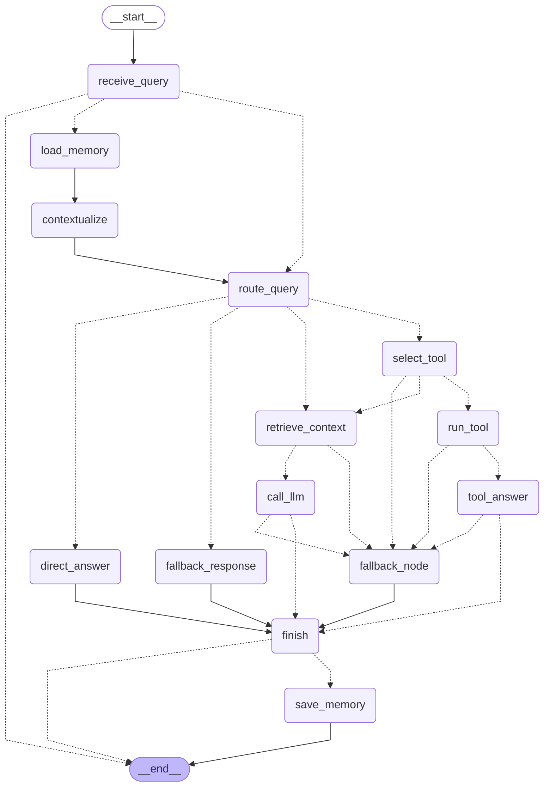

# Workflow graph (generated - do not edit; run `python -m scripts.draw_graph`)

```mermaid
---
config:
  flowchart:
    curve: linear
---
graph TD;
	__start__([<p>__start__</p>]):::first
	receive_query(receive_query)
	load_memory(load_memory)
	contextualize(contextualize)
	save_memory(save_memory)
	route_query(route_query)
	direct_answer(direct_answer)
	fallback_response(fallback_response)
	select_tool(select_tool)
	run_tool(run_tool)
	tool_answer(tool_answer)
	retrieve_context(retrieve_context)
	call_llm(call_llm)
	fallback_node(fallback_node)
	finish(finish)
	__end__([<p>__end__</p>]):::last
	__start__ --> receive_query;
	call_llm -.-> fallback_node;
	call_llm -.-> finish;
	contextualize --> route_query;
	direct_answer --> finish;
	fallback_node --> finish;
	fallback_response --> finish;
	finish -.-> __end__;
	finish -.-> save_memory;
	load_memory --> contextualize;
	receive_query -.-> __end__;
	receive_query -.-> load_memory;
	receive_query -.-> route_query;
	retrieve_context -.-> call_llm;
	retrieve_context -.-> fallback_node;
	route_query -.-> direct_answer;
	route_query -.-> fallback_response;
	route_query -.-> retrieve_context;
	route_query -.-> select_tool;
	run_tool -.-> fallback_node;
	run_tool -.-> tool_answer;
	select_tool -.-> fallback_node;
	select_tool -.-> retrieve_context;
	select_tool -.-> run_tool;
	tool_answer -.-> fallback_node;
	tool_answer -.-> finish;
	save_memory --> __end__;
	classDef default fill:#f2f0ff,line-height:1.2
	classDef first fill-opacity:0
	classDef last fill:#bfb6fc

```
