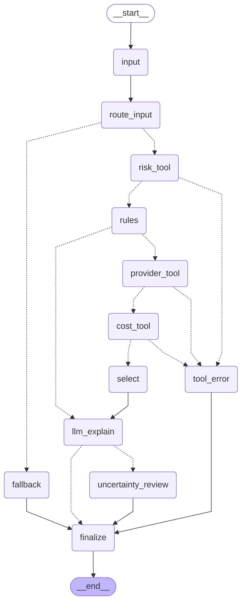

# Decision workflow (generated - run `python -m scripts.draw_graph`)

```mermaid
---
config:
  flowchart:
    curve: linear
---
graph TD;
	__start__([<p>__start__</p>]):::first
	input(input)
	route_input(route_input)
	fallback(fallback)
	uncertainty_review(uncertainty_review)
	risk_tool(risk_tool)
	rules(rules)
	provider_tool(provider_tool)
	cost_tool(cost_tool)
	select(select)
	llm_explain(llm_explain)
	tool_error(tool_error)
	finalize(finalize)
	__end__([<p>__end__</p>]):::last
	__start__ --> input;
	cost_tool -.-> select;
	cost_tool -.-> tool_error;
	fallback --> finalize;
	input --> route_input;
	llm_explain -.-> finalize;
	llm_explain -.-> uncertainty_review;
	provider_tool -.-> cost_tool;
	provider_tool -.-> tool_error;
	risk_tool -.-> rules;
	risk_tool -.-> tool_error;
	route_input -.-> fallback;
	route_input -.-> risk_tool;
	rules -.-> llm_explain;
	rules -.-> provider_tool;
	select --> llm_explain;
	tool_error --> finalize;
	uncertainty_review --> finalize;
	finalize --> __end__;
	classDef default fill:#f2f0ff,line-height:1.2
	classDef first fill-opacity:0
	classDef last fill:#bfb6fc

```
